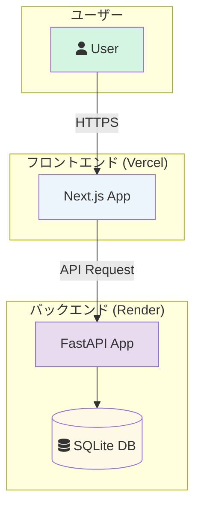
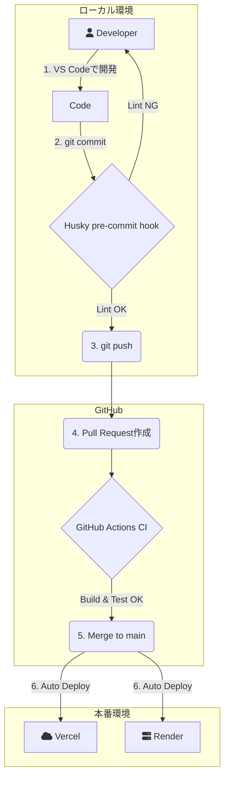

# Monorepo App with Next.js and FastAPI

このリポジトリは、Next.js（フロントエンド）とFastAPI（バックエンド）で構成されたモノリポ構成のサンプルアプリケーションです。

## サービス構成図



## 開発ワークフロー図



## 1. セットアップ手順

### ステップ1: 前提条件の確認とVS Code拡張機能のインストール

開発を始める前に、お使いの環境に以下がインストールされていることを確認してください。

*   **Node.js**: v20.x 以上
*   **Python**: v3.11.x
* **VS Code**: このプロジェクトの推奨エディタです。

次に、VS Codeで以下の拡張機能を**必ずインストールしてください**。これがないと、フロントエンドの自動フォーマットが機能しません。

* **[ESLint](https://marketplace.visualstudio.com/items?itemName=dbaeumer.vscode-eslint)**

### ステップ2: リポジトリのセットアップ

お使いのOSに合わせて、以下の手順でセットアップを行ってください。

### macOS / Linux

リポジトリをクローンした後、以下のスクリプトを一度だけ実行してください。
必要な依存関係のインストールと、開発環境の初期設定がすべて自動で行われます。

```bash
bash setup.sh
```
> **Note:**
> もし `permission denied` エラーが出る場合は、`chmod +x setup.sh` を実行して権限を付与してください。

### Windows

Windowsでは、以下の手順で手動セットアップを行ってください。

1.  **リポジトリをクローンします。**

2.  **バックエンドのセットアップ (PowerShell or コマンドプロンプト):**
    ```powershell
    # Python仮想環境の作成
    python -m venv backend\.venv

    # 仮想環境の有効化
    .\backend\.venv\Scripts\activate

    # 依存関係のインストール
    pip install -r backend\requirements.txt
    ```

3.  **フロントエンドのセットアップ (PowerShell or コマンドプロンプト):**
    ```powershell
    # フロントエンドのディレクトリに移動
    cd frontend

    # 依存関係のインストール
    npm install

    # ルートディレクトリに戻る
    cd ..
    ```

## 3. 動作確認

セットアップ完了後、以下の手順で各サービスを起動できます。

### バックエンド (FastAPI)

1.  **仮想環境の有効化:**
    新しいターミナルを開き、お使いのOSに合わせて仮想環境を有効化します。

    *   **macOS / Linux:**
        ```bash
        source backend/.venv/bin/activate
        ```
    *   **Windows (PowerShell or コマンドプロンプト):**
        ```powershell
        .\backend\.venv\Scripts\activate
        ```

2.  **サーバーの起動:**
    ```bash
    uvicorn backend.main:app --reload
    ```

3.  **APIドキュメントの確認:**
    ブラウザで [http://127.0.0.1:8000/docs](http://127.0.0.1:8000/docs) にアクセスすると、Swagger UIが表示され、APIの動作を確認できます。

### フロントエンド (Next.js)

1.  **開発サーバーの起動:**
    別のターミナルを開き、以下のコマンドを実行します。
    ```bash
    cd frontend
    npm run dev
    ```

2.  **アプリケーションの確認:**
    ブラウザで [http://localhost:3000](http://localhost:3000) にアクセスすると、アプリケーションが表示されます。

## 4. 開発ワークフロー

### コードフォーマット

*   **保存時の自動フォーマット (VS Code):**
    *   このリポジトリにはチーム共通のVS Code設定 (`.vscode/settings.json`) が含まれています。
    *   ESLint拡張機能をインストールしていれば、ファイルを保存するだけで自動的にコードが整形されます。

*   **コミット時の自動チェック (Husky):**
    *   フロントエンドのファイルをコミットする際、`lint-staged`が走り、`eslint`によるチェックと自動修正が行われます。

### CI/CD

*   **CI (継続的インテグレーション):**
    *   `main`ブランチへのプルリクエスト作成時、GitHub Actionsが自動で実行されます。
    *   フロントエンドとバックエンドのビルドが通り、コードの品質が保たれているかをチェックします。
*   **CD (継続的デプロイ):**
    *   `main`ブランチへのマージ後、フロントエンドはVercelに、バックエンドはRenderに自動でデプロイされます。
